# Danh sách 31 Sơ đồ hoạt động (Activity Diagrams)

Dưới đây là mã PlantUML cho toàn bộ 31 chức năng dựa theo Ma trận phân quyền.
Bạn copy từng đoạn code (từ @startuml đến @enduml) dán vào trang https://www.plantuml.com/plantuml/uml/ để lấy ảnh nhé.

---

### 1. Xem trang chủ, danh mục, sản phẩm, bài viết
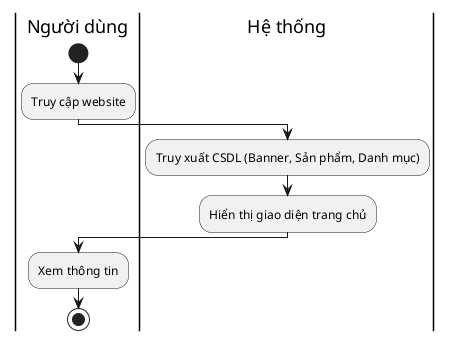

### 2. Tìm kiếm, lọc sản phẩm
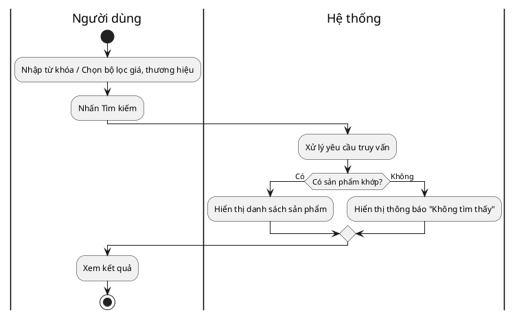

### 3. Tương tác hỏi đáp với Chatbot AI
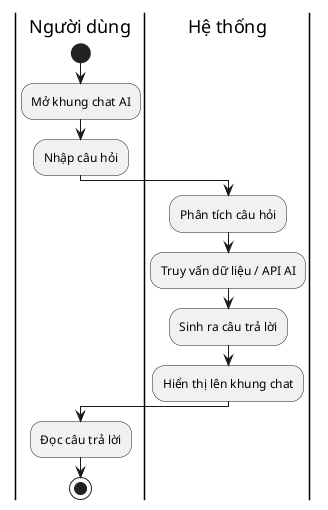

### 4. Đăng ký nhận bản tin khuyến mãi qua Email
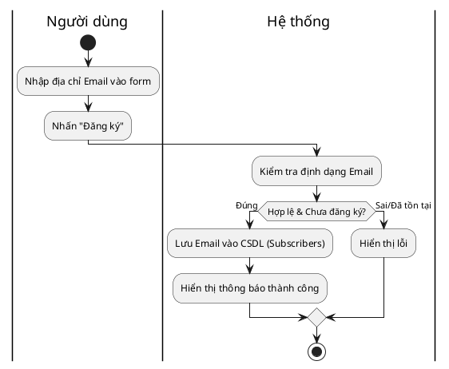

### 5. Đăng ký tài khoản thành viên mới
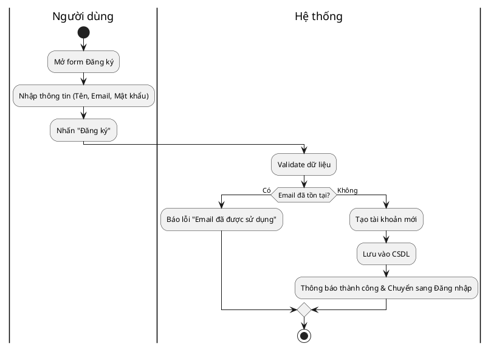

### 6. Đăng nhập hệ thống mua sắm (Khách hàng)
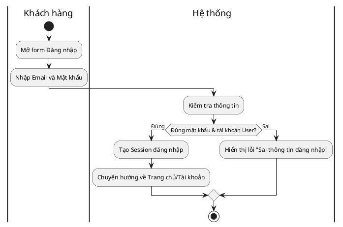

### 7. Xem và quản lý giỏ hàng cá nhân
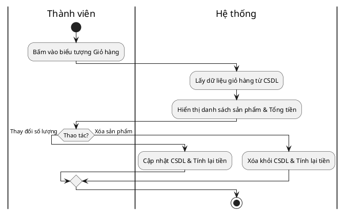

### 8. Thêm/Xóa sản phẩm vào Danh sách yêu thích
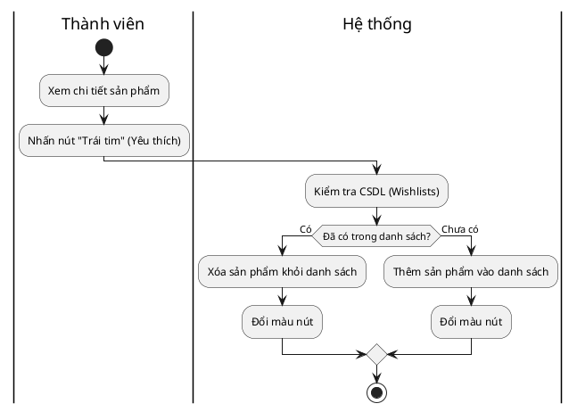

### 9. Đặt hàng và áp dụng mã giảm giá
*(Đã vẽ chi tiết ở phần trước có VNPay, đây là bản tóm gọn)*
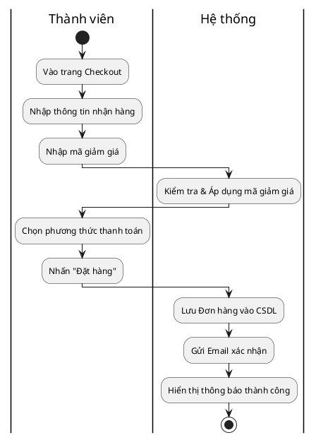

### 10. Theo dõi trạng thái đơn hàng, xem lịch sử mua hàng
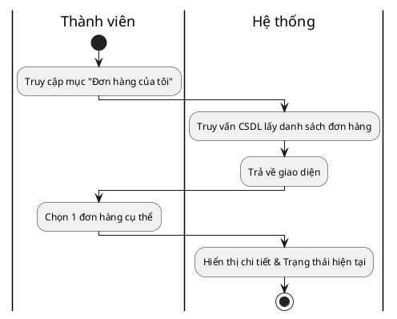

### 11. Viết đánh giá, bình luận cho sản phẩm đã mua
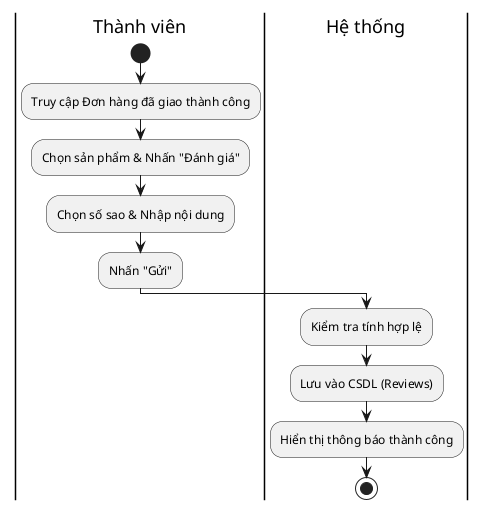

### 12. Gửi yêu cầu hủy đơn hàng, hoàn trả hàng
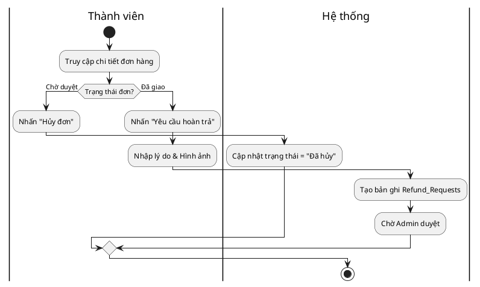

### 13. Đăng nhập hệ thống Quản trị (Admin)
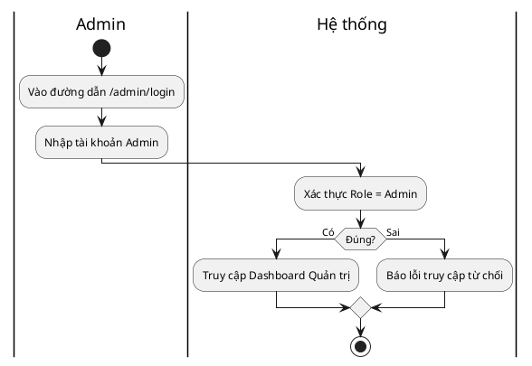

### 14 & 15 & 17. Quản lý (Thêm/Sửa/Xóa) Danh mục/Sản phẩm/Tin tức/Mã giảm giá
*(Quy trình CRUD chung cho Admin)*
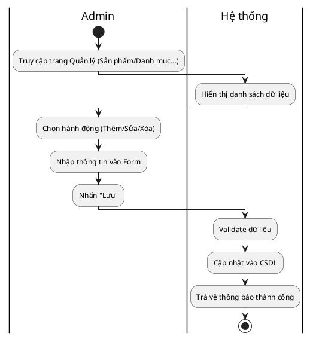

### 16. Quản lý Kho hàng, xem lịch sử nhập/xuất kho
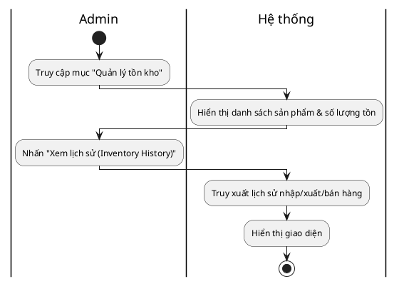

### 18. Quản lý và kiểm duyệt đánh giá của khách hàng
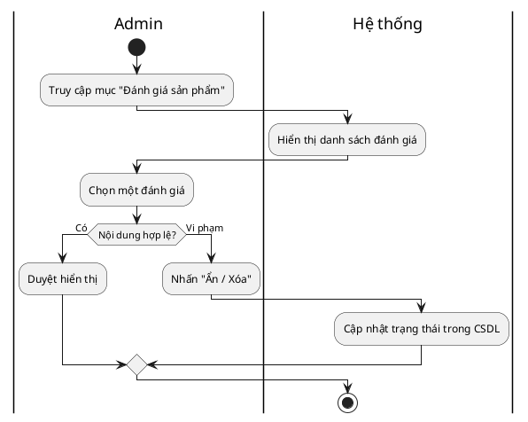

### 19. Thiết lập Chatbot AI, xem lịch sử chat
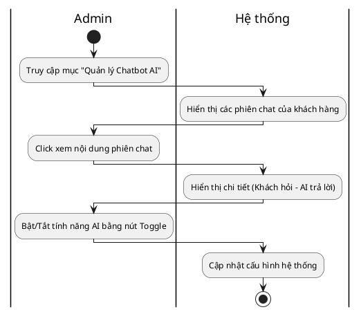

### 20. Quản lý người dùng, khóa/mở tài khoản
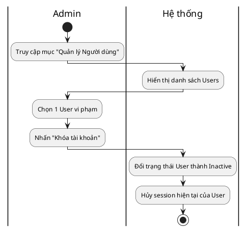

### 21. Quản lý Đơn hàng toàn hệ thống, xử lý Hủy/Hoàn
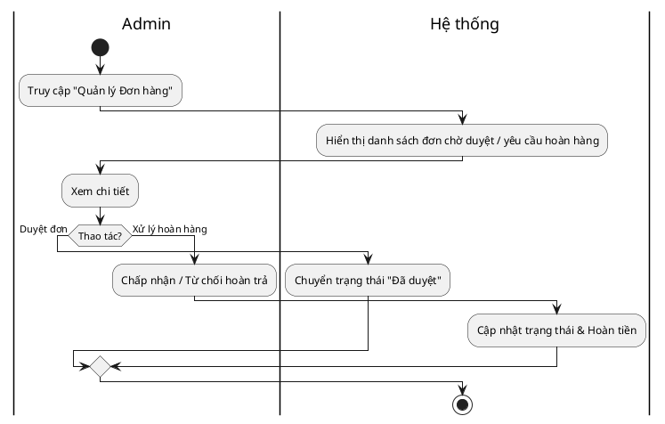

### 22. Điều phối, phân công đơn hàng cho Shipper
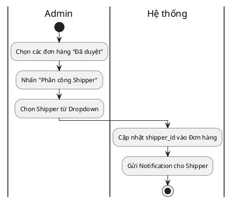

### 23. Xem biểu đồ thống kê, báo cáo doanh thu
```plantuml
@startuml
|Admin|
start
:Truy cập Dashboard / Báo cáo;
:Chọn khoảng thời gian (Từ ngày - Đến ngày);
|Hệ thống|
:Query tính toán tổng doanh thu, số đơn;
:Vẽ biểu đồ (Chart);
:Hiển thị lên màn hình;
stop
@enduml
```

### 24. Đăng nhập hệ thống Giao hàng (Shipper)
```plantuml
@startuml
|Shipper|
start
:Truy cập cổng Shipper (/shipper/login);
:Nhập tài khoản;
|Hệ thống|
:Xác thực Role = Shipper;
if (Hợp lệ?) then (Đúng)
  :Mở giao diện Shipper;
else (Sai)
  :Báo lỗi;
endif
stop
@enduml
```

### 25 & 26. Xem danh sách & Chi tiết đơn hàng được phân công
```plantuml
@startuml
|Shipper|
start
:Truy cập mục "Đơn hàng của tôi";
|Hệ thống|
:Lấy danh sách đơn có shipper_id khớp;
:Hiển thị danh sách;
|Shipper|
:Nhấn vào 1 đơn hàng;
|Hệ thống|
:Hiển thị tên, SĐT, địa chỉ, số tiền COD;
stop
@enduml
```

### 27. Cập nhật trạng thái lấy hàng, kết quả giao hàng
```plantuml
@startuml
|Shipper|
start
:Xem chi tiết đơn hàng;
if (Đã lấy hàng?) then (Đã lấy)
  :Nhấn "Bắt đầu giao";
  |Hệ thống|
  :Cập nhật = "Shipping";
else (Đang giao)
  |Shipper|
  :Đến nhà khách hàng;
  if (Thành công?) then (Khách nhận)
    :Nhấn "Giao thành công";
    |Hệ thống|
    :Cập nhật = "Completed";
  else (Thất bại)
    |Shipper|
    :Nhấn "Giao thất bại";
    |Hệ thống|
    :Cập nhật = "Failed Delivery";
  endif
endif
stop
@enduml
```

### 28. Ghi chú, báo cáo sự cố giao hàng
```plantuml
@startuml
|Shipper|
start
:Đơn hàng giao thất bại;
:Mở popup Ghi chú;
:Nhập lý do (Ví dụ: Khách boom hàng);
:Nhấn "Gửi báo cáo";
|Hệ thống|
:Lưu ghi chú vào CSDL đính kèm đơn hàng;
:Thông báo cho Admin;
stop
@enduml
```

### 29. Xem thống kê lịch sử giao hàng cá nhân
```plantuml
@startuml
|Shipper|
start
:Truy cập mục "Thống kê";
|Hệ thống|
:Tính toán số đơn thành công/thất bại;
:Hiển thị tổng tiền COD đã thu;
|Shipper|
:Xem để đối soát cuối ngày;
stop
@enduml
```

### 30. Cập nhật thông tin tài khoản cá nhân, đổi mật khẩu
```plantuml
@startuml
|Người dùng (All)|
start
:Truy cập "Hồ sơ cá nhân";
:Đổi thông tin hoặc nhập mật khẩu mới;
:Nhấn "Cập nhật";
|Hệ thống|
:Kiểm tra mật khẩu cũ (nếu có);
:Lưu dữ liệu mới;
:Thông báo thành công;
stop
@enduml
```

### 31. Nhận và xem thông báo từ hệ thống
```plantuml
@startuml
|Người dùng (All)|
start
:Nhấn vào icon "Quả chuông" (Notification);
|Hệ thống|
:Lấy danh sách thông báo chưa đọc từ CSDL;
:Hiển thị danh sách;
|Người dùng (All)|
:Click vào 1 thông báo;
|Hệ thống|
:Đánh dấu "Đã đọc";
:Chuyển hướng đến link chi tiết (Ví dụ: Đơn hàng);
stop
@enduml
```
